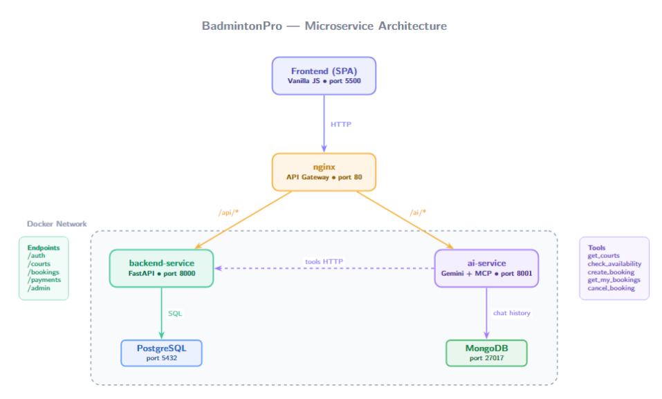
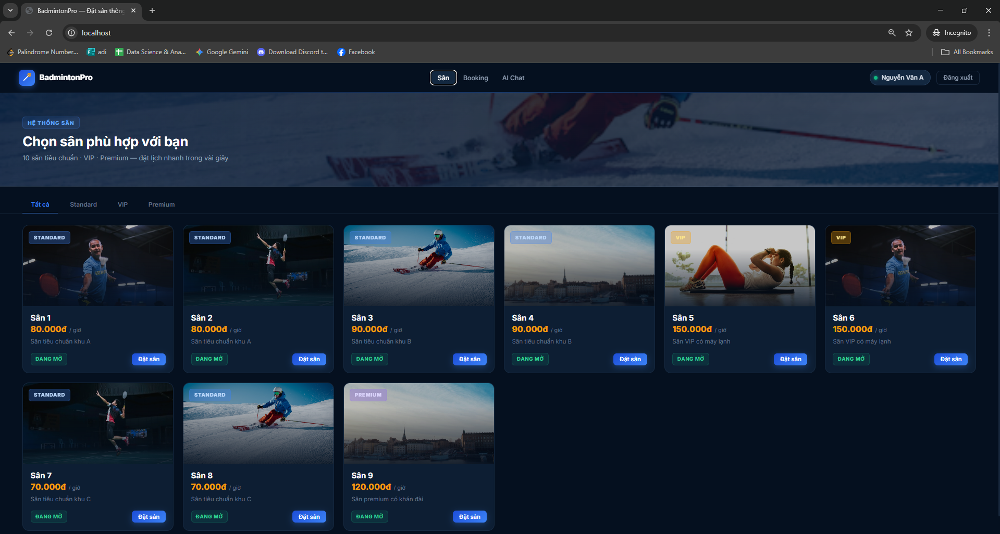
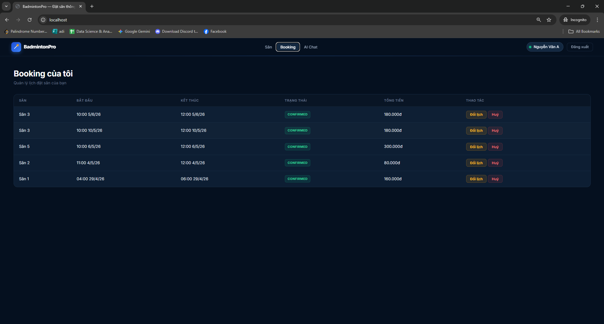
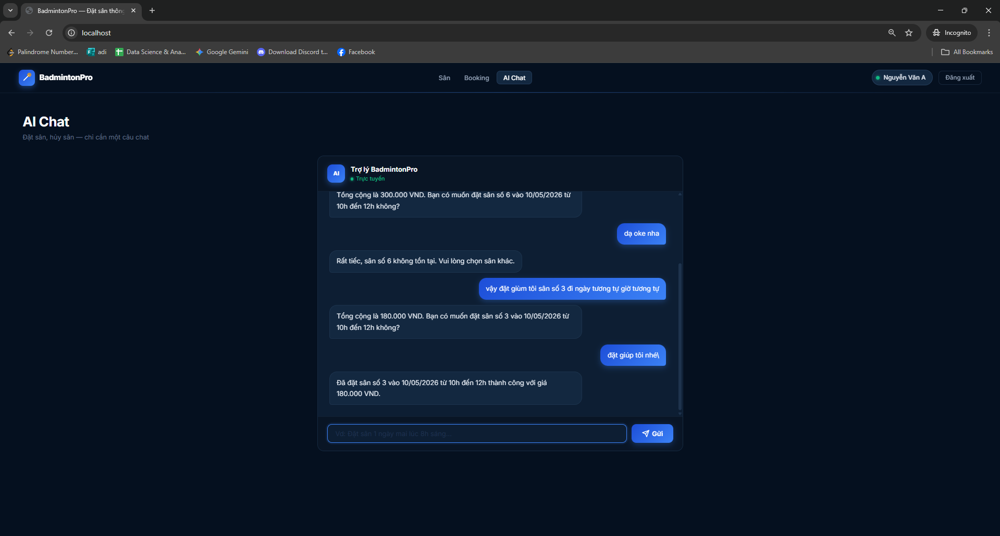
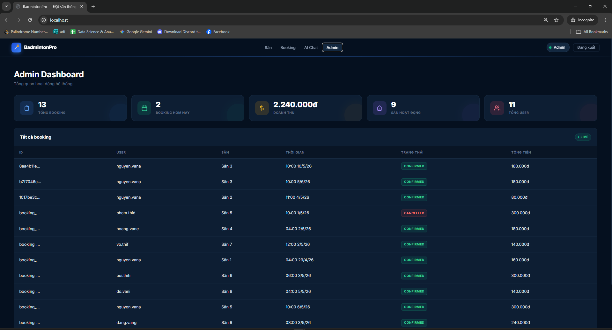

# BadmintonPro — Hệ thống đặt sân cầu lông thông minh

Ứng dụng đặt sân cầu lông với trợ lý AI tích hợp Gemini, xây dựng theo kiến trúc Microservices.

---

## Kiến trúc hệ thống



> Xem file `architecture.tex` để chỉnh sửa hoặc export lại diagram.

---

## Screenshots

### Danh sách sân


### Quản lý booking


### AI Chat — Đặt sân bằng hội thoại


### Admin Dashboard


---

## Services

| Service | Port | Công nghệ | Trách nhiệm |
|---------|------|-----------|-------------|
| `backend` | 8000 | FastAPI + SQLAlchemy | Auth, Courts, Bookings, Payments, Admin |
| `ai` | 8001 | FastAPI + Gemini API | AI Chat, Function Calling, MCP Server |
| `nginx` | 80 | nginx:alpine | API Gateway + Frontend static |
| `postgres` | 5432 | PostgreSQL 16 | Dữ liệu nghiệp vụ |
| `mongodb` | 27017 | MongoDB 7 | Chat history |

---

## Cài đặt & Chạy

### Yêu cầu
- Docker Desktop
- Python 3.12+ (cho dev local)

### 1. Clone và cấu hình

```bash
git clone <repo-url>
cd AI_badminton
cp .env.example .env
# Chỉnh sửa .env: điền POSTGRES_PASSWORD, SECRET_KEY, GEMINIUS_API_KEY
```

### 2. Chạy bằng Docker Compose

```bash
docker compose up --build
```

### 3. Khởi tạo database (lần đầu)

```bash
docker compose exec backend python -m backend.db_connect
docker compose exec backend python backend/scripts/reset_db.py
```

### 4. Truy cập

| URL | Mô tả |
|-----|-------|
| `http://localhost` | Frontend |
| `http://localhost/api/docs` | Backend API docs |
| `http://localhost:8001/docs` | AI Service docs (dev) |

---

## Chạy dev local (không Docker)

```bash
# Tạo và kích hoạt venv
python -m venv venv
source venv/Scripts/activate   # Windows Git Bash
# hoặc: venv\Scripts\Activate.ps1  (PowerShell)

# Cài dependencies
pip install -r requirements-dev.txt

# Terminal 1 — Backend
uvicorn backend.api.main:app --reload --port 8000

# Terminal 2 — AI Service
uvicorn ai_service.main:app --reload --port 8001
```

Đặt `DEV = true` trong `frontend/app.js` khi chạy không có nginx.

---

## Tài khoản test

| Email | Password | Role |
|-------|----------|------|
| `nguyen.vana@gmail.com` | `123` | User |
| `admin@badminton.com` | `admin` | Admin |

---

## Cấu trúc thư mục

```
AI_badminton/
├── backend/            # REST API (FastAPI + PostgreSQL)
│   ├── api/            # Routers: auth, courts, bookings, payments, admin
│   ├── models/         # SQLAlchemy models
│   ├── schemas/        # Pydantic schemas
│   ├── scripts/        # seed.py, reset_db.py
│   ├── config.py
│   ├── security.py
│   └── Dockerfile
├── ai_service/         # AI Service (Gemini + MongoDB)
│   ├── main.py
│   ├── router.py       # /ai/* endpoints
│   ├── gemini_client.py
│   ├── tools.py        # HTTP calls tới backend
│   ├── database.py     # MongoDB chat history
│   ├── mcp_server.py   # MCP Server
│   └── Dockerfile
├── frontend/           # SPA (HTML + CSS + Vanilla JS)
├── nginx/              # API Gateway config
├── docker-compose.yml
├── .env.example
└── CLAUDE.md           # Hướng dẫn kiến trúc & build
```

---

## Environment Variables

```env
# PostgreSQL
POSTGRES_HOST=localhost
POSTGRES_PORT=5432
POSTGRES_USER=postgres
POSTGRES_PASSWORD=your_password
POSTGRES_DB=badminton_db

# JWT
SECRET_KEY=your-secret-key

# Gemini AI
GEMINIUS_API_KEY=your-gemini-api-key
GEMINIUS_MODEL=gemini-2.5-flash

# MongoDB
MONGODB_URI=mongodb://localhost:27017
MONGODB_DB=ai_worker_db

# AI Service → Backend (Docker)
BACKEND_SERVICE_URL=http://localhost:8000
```

---

## Gemini Function Calling Flow

```
User nhắn: "Đặt sân 1 ngày mai lúc 8h"
    │
    ▼
POST /ai/chat  →  ai-service nhận JWT
    │
    ▼
Gemini quyết định gọi tool "create_booking"
    │   (Gemini chỉ trả JSON, không tự gọi HTTP)
    ▼
ai_service/tools.py thực thi:
    POST http://backend:8000/bookings  (kèm JWT)
    │
    ▼
backend xử lý, lưu PostgreSQL, trả kết quả
    │
    ▼
Gemini đọc kết quả → sinh câu trả lời tiếng Việt
    │
    ▼
Lưu lịch sử vào MongoDB → trả về frontend
```
